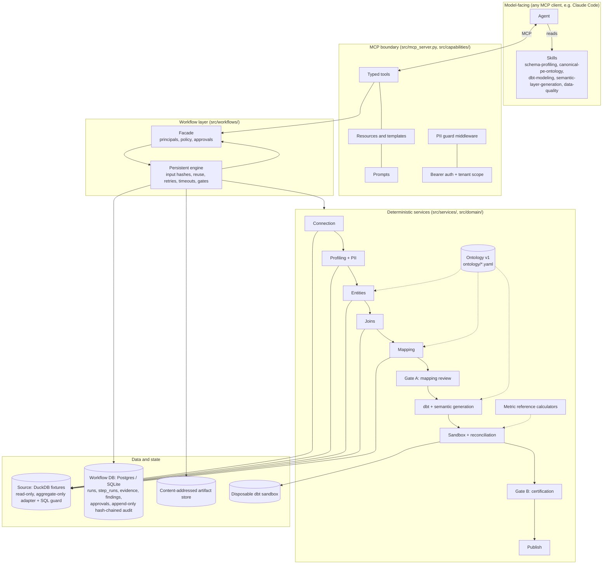
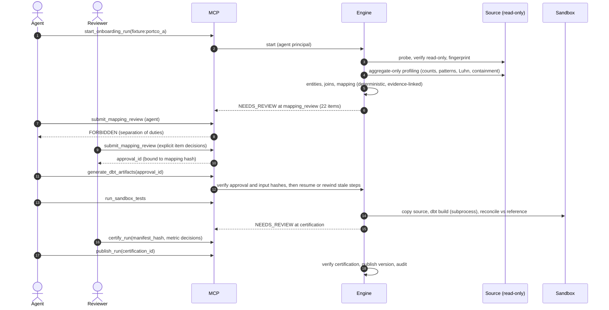
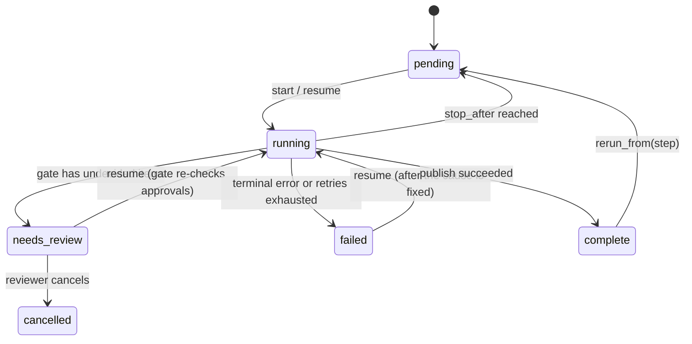

# Architecture

The system follows the handoff's four-layer design. Deterministic services own every number, join
and side effect. MCP is the capability contract. Skills carry procedure. A persistent workflow
engine owns state and recovery, so the conversation is never the source of truth.

## Layers

## One run, end to end

## Run state machine

## Key properties and where they live

| Property | Mechanism | Code |
|---|---|---|
| State outside the conversation | Every step persists output (content-addressed), evidence, findings and audit in one transaction | `src/workflows/base.py`, `src/adapters/repositories.py` |
| Idempotent reruns | Hashes bind upstream output, implementation, configuration and source policy; publish always verifies files | `WorkflowEngine._run_step`, ADR-0012 |
| Deterministic evidence ids | uuid5(run, source URI, content hash) | `src/workflows/contracts.py::make_evidence` |
| No raw PII in context | Aggregate-only adapter, PII guard middleware on every MCP response, hashed or excluded PII in staging | ADR-0003, `src/capabilities/guard.py` |
| Approvals cannot be faked or go stale | Server-side lookup, bound to the subject content hash, revoked on change | ADR-0004, `src/services/approvals.py` |
| The agent cannot approve | Role-based policy registry; the starter cannot approve their own run | ADR-0009, `src/domain/policies.py` |
| Generated SQL tested first | Disposable sandbox, read-only attach, exact reconciliation | ADR-0008, `src/services/sandbox.py` |
| Tamper-evident audit | Per-run hash chain; Postgres trigger forbids UPDATE/DELETE | `AuditRepository`, `migrations/versions/0001_initial.py` |
| Recovery | Error taxonomy, retries with backoff, per-step timeouts, fault injection | `src/domain/errors.py`, `src/adapters/faults.py` |

## Decisions
See `docs/adr/` (ADR-0001 to ADR-0012). [ADR-0012](adr/0012-recoverable-publication.md)
describes publication recovery and the point after which cancellation is too late.

Local reviewer identities rely on a trusted OS operator. Anyone who controls the local process,
configuration or state database is outside the agent-role boundary. The scripted demo uses synthetic
reviewer decisions; only a separately recorded human session establishes independent human review.
