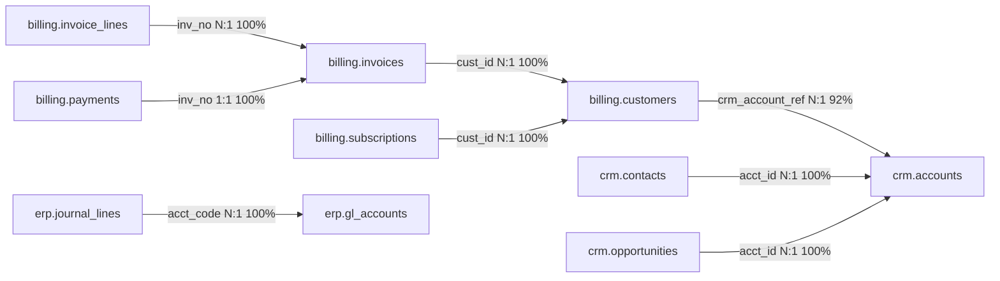

# Onboarding run report: portco_a__malformed

- Run: `cdda65a4-f929-4ca2-ba0a-3dacfdebc2bb`
- Connection: `fixture:portco_a__malformed`
- Status: **needs_review** (gate: test_failures)
- Audit chain: intact (32 events)
- Human changes to recommendations: 0

## Timeline

| step | status | attempts | seconds |
|---|---|---|---|
| connection_validation | completed | 1 | 0.194 |
| schema_profiling | completed | 1 | 1.024 |
| entity_inference | completed | 1 | 0.109 |
| join_inference | completed | 1 | 0.507 |
| canonical_mapping | completed | 1 | 0.057 |
| mapping_review | completed | 2 | 0.024 |
| artifact_generation | completed | 1 | 0.117 |
| automated_tests | needs_review | 1 | 7.364 |
| human_certification | pending | 0 | 0 |
| publish | pending | 0 | 0 |

## Observations

| code | confidence | status | statement | evidence |
|---|---|---|---|---|
| CONNECTION_VERIFIED | high | supported | 4 schemas and 11 tables visible; write probe was rejected. | `7ebbce53` |
| TEST_RECORDS | high | supported | 3 rows in billing.customers.cust_name start with 'TEST'. | `907c016a` |
| DUPLICATE_ENTITIES | medium | supported | 4 of 127 values in billing.customers.cust_name collide after normalizing case and punctuation; the same real-world entity likely has several records. | `907c016a` |
| MULTI_CURRENCY | high | supported | billing.customers.currency holds 3 currencies (EUR, GBP, USD); no FX table was found, so amounts are never summed across currencies. | `907c016a` |
| MIXED_TYPES | high | supported | 490 of 1962 values are numeric, the rest text. | `10aae13b` |
| MULTI_CURRENCY | high | supported | billing.invoices.currency holds 3 currencies (EUR, GBP, USD); no FX table was found, so amounts are never summed across currencies. | `10aae13b` |
| MULTI_CURRENCY | high | supported | billing.subscriptions.currency holds 3 currencies (EUR, GBP, USD); no FX table was found, so amounts are never summed across currencies. | `4b0036ad` |
| TEST_RECORDS | high | supported | 2 rows in crm.accounts.acct_nm start with 'TEST'. | `8e4413ec` |
| SOFT_DELETE_FLAG | high | supported | 5 rows are flagged deleted. | `8e4413ec` |
| PII_CLASSIFIED | high | supported | 10 columns classified as PII; their values never leave the adapter. | `907c016a`, `115e5d72`, `10aae13b` |
| ENTITY_OVERLAP | medium | supported | billing.customers, crm.accounts all classify as customer. System of record: billing.customers; the others enrich it through a reviewed join. | `916fe7bc`, `6206eb17` |
| ORPHAN_KEYS | high | supported | 7.9% of rows reference a crm.accounts key that does not exist (containment 91.8%). | `d9f3e802` |
| JOIN_INFERRED | high | supported | billing.customers.crm_account_ref->crm.accounts.acct_id: N:1, score 0.91, containment 91.8%. | `d9f3e802` |
| JOIN_INFERRED | high | supported | billing.invoice_lines.inv_no->billing.invoices.inv_no: N:1, score 1.00, containment 100.0%. | `5b340543` |
| JOIN_INFERRED | high | supported | billing.invoices.cust_id->billing.customers.cust_id: N:1, score 1.00, containment 100.0%. | `cc42ad2d` |
| JOIN_INFERRED | high | supported | billing.payments.inv_no->billing.invoices.inv_no: 1:1, score 1.00, containment 100.0%. | `90fedfbb` |
| JOIN_INFERRED | high | supported | billing.subscriptions.cust_id->billing.customers.cust_id: N:1, score 1.00, containment 100.0%. | `a8ee42f4` |
| JOIN_INFERRED | high | supported | crm.contacts.acct_id->crm.accounts.acct_id: N:1, score 1.00, containment 100.0%. | `20341d52` |
| JOIN_INFERRED | high | supported | crm.opportunities.acct_id->crm.accounts.acct_id: N:1, score 1.00, containment 100.0%. | `278fcd4a` |
| JOIN_INFERRED | high | supported | erp.journal_lines.acct_code->erp.gl_accounts.acct_code: N:1, score 1.00, containment 100.0%. | `7b87dd6d` |
| MAPPING_REVIEWED | high | supported | 22 items reviewed: 68 mappings accepted (50 automatically), 0 overridden, 0 rejected. | `eb9d0c8a` |
| SANDBOX_FAILED | high | supported | 2 checks failed; nothing publishes unless a reviewer waives. | `a72c464f` |

## Calculations

| code | confidence | status | statement | evidence |
|---|---|---|---|---|
| POSSIBLE_MINOR_UNITS | medium | supported | Integer money column whose mean is 90x the median of decimal money columns in the same schema; it is probably stored in cents. | `115e5d72` |
| ARTIFACTS_GENERATED | high | supported | 34 models, 9 metrics generated; 9 metrics not generated (reasons recorded). Manifest 64baf971ce58. | `0c1701ba` |
| SANDBOX_TESTS | high | supported | dbt exit 1; 97 data tests; 25/25 reconciliation checks passed; 2 failing. | `a72c464f` |

## Mapping proposals

| source | canonical | confidence | score | review reasons | decision |
|---|---|---|---|---|---|
| billing.customers.cust_id | customer.customer_id | high | 0.97 | - | auto |
| billing.customers.crm_account_ref | customer.crm_account_id | high | 1.00 | - | auto |
| billing.customers.cust_name | customer.customer_name | high | 1.00 | - | auto |
| billing.customers.billing_email | customer.billing_email | high | 1.00 | PII_FIELD | reviewer |
| billing.customers.country | customer.country | high | 1.00 | - | auto |
| billing.customers.currency | customer.currency | high | 1.00 | - | auto |
| billing.invoice_lines.line_id | invoice_line.invoice_line_id | high | 0.97 | - | auto |
| billing.invoice_lines.inv_no | invoice_line.invoice_id | high | 1.00 | - | auto |
| billing.invoice_lines.sku | invoice_line.sku | high | 1.00 | - | auto |
| billing.invoice_lines.qty | invoice_line.quantity | high | 1.00 | - | auto |
| billing.invoice_lines.amount | invoice_line.amount | high | 0.95 | UNIT_MISMATCH | reviewer |
| billing.invoices.inv_no | invoice.invoice_id | high | 1.00 | - | auto |
| billing.invoices.cust_id | invoice.customer_id | high | 0.97 | - | auto |
| billing.invoices.inv_date | invoice.invoice_date | high | 1.00 | - | auto |
| billing.invoices.due_date | invoice.due_date | high | 1.00 | - | auto |
| billing.invoices.total_amt | invoice.total_amount | high | 1.00 | METRIC_BEARING | reviewer |
| billing.invoices.currency | invoice.currency | high | 1.00 | - | auto |
| billing.invoices.status | invoice.status | high | 1.00 | - | auto |
| billing.payments.pmt_id | payment.payment_id | high | 1.00 | - | auto |
| billing.payments.inv_no | payment.invoice_id | high | 1.00 | - | auto |
| billing.payments.paid_at | payment.paid_at | high | 1.00 | - | auto |
| billing.payments.amount | payment.amount | high | 1.00 | METRIC_BEARING | reviewer |
| billing.payments.method | payment.method | high | 1.00 | - | auto |
| billing.payments.card_number | payment.card_number | high | 1.00 | PII_FIELD | reviewer |
| billing.payments.card_last4 | payment.card_last4 | high | 1.00 | - | auto |
| billing.subscriptions.sub_id | subscription.subscription_id | high | 1.00 | - | auto |
| billing.subscriptions.cust_id | subscription.customer_id | high | 0.97 | - | auto |
| billing.subscriptions.plan_code | subscription.plan_code | high | 1.00 | - | auto |
| billing.subscriptions.mrr_amt | subscription.mrr | high | 1.00 | METRIC_BEARING | reviewer |
| billing.subscriptions.currency | subscription.currency | high | 1.00 | - | auto |
| billing.subscriptions.start_dt | subscription.start_date | high | 1.00 | - | auto |
| billing.subscriptions.end_dt | subscription.end_date | high | 1.00 | - | auto |
| billing.subscriptions.status | subscription.status | high | 1.00 | - | auto |
| crm.accounts.acct_id | customer.crm_account_id | high | 0.95 | - | auto |
| crm.accounts.acct_nm | customer.customer_name | high | 0.95 | - | auto |
| crm.accounts.industry | customer.industry | high | 0.95 | - | auto |
| crm.accounts.owner_email | customer.owner_email | high | 0.95 | PII_FIELD | reviewer |
| crm.accounts.created_dt | customer.created_date | high | 0.93 | TRANSFORM_REQUIRED | reviewer |
| crm.accounts.is_deleted | customer.is_deleted | high | 0.95 | - | auto |
| crm.contacts.contact_id | contact.contact_id | high | 0.97 | - | auto |
| crm.contacts.acct_id | contact.crm_account_id | high | 1.00 | - | auto |
| crm.contacts.first_name | contact.first_name | high | 1.00 | PII_FIELD | reviewer |
| crm.contacts.last_name | contact.last_name | high | 1.00 | PII_FIELD | reviewer |
| crm.contacts.email | contact.email | high | 1.00 | PII_FIELD | reviewer |
| crm.contacts.phone | contact.phone | high | 1.00 | PII_FIELD | reviewer |
| crm.opportunities.opp_id | opportunity.opportunity_id | high | 1.00 | - | auto |
| crm.opportunities.acct_id | opportunity.crm_account_id | high | 1.00 | - | auto |
| crm.opportunities.rev | opportunity.amount | low | 0.35 | LOW_CONFIDENCE, SEMANTIC_TRAP | reviewer |
| crm.opportunities.stage | opportunity.stage | high | 1.00 | - | auto |
| crm.opportunities.close_date | opportunity.close_date | high | 1.00 | - | auto |
| erp.gl_accounts.acct_code | gl_account.account_code | high | 1.00 | - | auto |
| erp.gl_accounts.acct_name | gl_account.account_name | high | 1.00 | - | auto |
| erp.gl_accounts.acct_type | gl_account.account_type | high | 1.00 | - | auto |
| erp.journal_lines.je_id | gl_entry.journal_id | high | 1.00 | - | auto |
| erp.journal_lines.line_no | gl_entry.line_number | high | 1.00 | - | auto |
| erp.journal_lines.acct_code | gl_entry.account_code | high | 1.00 | - | auto |
| erp.journal_lines.posting_date | gl_entry.posting_date | high | 1.00 | - | auto |
| erp.journal_lines.debit | gl_entry.debit_amount | high | 1.00 | METRIC_BEARING | reviewer |
| erp.journal_lines.credit | gl_entry.credit_amount | high | 1.00 | METRIC_BEARING | reviewer |
| erp.journal_lines.entity_code | gl_entry.entity_code | high | 1.00 | - | auto |
| hr.employees.emp_id | employee.employee_id | high | 1.00 | - | auto |
| hr.employees.full_name | employee.full_name | high | 1.00 | PII_FIELD | reviewer |
| hr.employees.ssn | employee.national_id | high | 1.00 | PII_FIELD | reviewer |
| hr.employees.dob | employee.date_of_birth | high | 1.00 | PII_FIELD | reviewer |
| hr.employees.dept | employee.department | high | 1.00 | - | auto |
| hr.employees.hire_date | employee.hire_date | high | 1.00 | - | auto |
| hr.employees.term_date | employee.termination_date | high | 1.00 | - | auto |
| hr.employees.salary | employee.salary | high | 1.00 | - | auto |

## Join graph

## Generated artifacts

- Manifest: `64baf971ce58f7e1c23c85c80abb96b7d1c346a4dd9bf357331675af4058fa9e`
- Models (34): dim_contact, dim_customer, dim_employee, dim_gl_account, fct_gl_entry, fct_invoice, fct_invoice_line, fct_mrr_monthly, fct_opportunity, fct_payment, fct_subscription, int_billing__customers, int_billing__invoice_lines, int_billing__invoices, int_billing__payments, int_billing__subscriptions, int_crm__accounts, int_crm__contacts, int_crm__opportunities, int_erp__gl_accounts, int_erp__journal_lines, int_hr__employees, metricflow_time_spine, stg_billing__customers, stg_billing__invoice_lines, stg_billing__invoices, stg_billing__payments, stg_billing__subscriptions, stg_crm__accounts, stg_crm__contacts, stg_crm__opportunities, stg_erp__gl_accounts, stg_erp__journal_lines, stg_hr__employees
- Metrics generated: active_customers, arr, billings, cogs, ebitda, gross_margin_pct, mrr, opex, revenue_recognized

| metric | why not generated |
|---|---|
| arpa | reference_only: computed by the reference service, not the semantic layer |
| churned_arr | reference_only: computed by the reference service, not the semantic layer |
| contraction_arr | reference_only: computed by the reference service, not the semantic layer |
| dso | reference_only: computed by the reference service, not the semantic layer |
| expansion_arr | reference_only: computed by the reference service, not the semantic layer |
| grr | reference_only: computed by the reference service, not the semantic layer |
| headcount | reference_only: computed by the reference service, not the semantic layer |
| new_arr | reference_only: computed by the reference service, not the semantic layer |
| nrr | reference_only: computed by the reference service, not the semantic layer |

## Sandbox tests

- dbt exit code 1; 97 data tests; passed: **False**

| reconciliation check | result | detail |
|---|---|---|
| rowcount:billing.customers | pass | source 127 rows, staging 127; filtered 3 (ref 3) |
| rowcount:billing.invoice_lines | pass | source 2107 rows, staging 2107; filtered 0 (ref 0) |
| rowcount:billing.invoices | pass | source 1962 rows, staging 1962; filtered 0 (ref 0) |
| rowcount:billing.payments | pass | source 1801 rows, staging 1801; filtered 0 (ref 0) |
| rowcount:billing.subscriptions | pass | source 165 rows, staging 165; filtered 0 (ref 0) |
| rowcount:crm.accounts | pass | source 122 rows, staging 122; filtered 7 (ref 7) |
| rowcount:crm.contacts | pass | source 244 rows, staging 244; filtered 0 (ref 0) |
| rowcount:crm.opportunities | pass | source 300 rows, staging 300; filtered 0 (ref 0) |
| rowcount:erp.gl_accounts | pass | source 12 rows, staging 12; filtered 0 (ref 0) |
| rowcount:erp.journal_lines | pass | source 7739 rows, staging 7739; filtered 0 (ref 0) |
| rowcount:hr.employees | pass | source 60 rows, staging 60; filtered 0 (ref 0) |
| mart:billings | pass | billings by month and currency: 72 periods compared exactly |
| mart:arr | pass | ARR by month and currency: 95 periods compared exactly |
| mart:active_customers | pass | active customers by month: 32 periods compared exactly |
| mart:revenue_recognized | pass | recognized revenue by month: 24 periods compared exactly |
| orphans:billing.customers.crm_account_ref->crm.accounts.acct_id | pass | orphan rate 7.87% (reviewed at 7.87%) |
| metric:active_customers | pass | generated semantic expression: 32 expected monthly groups, 32 actual |
| metric:arr | pass | generated semantic expression: 95 expected monthly groups, 95 actual |
| metric:billings | pass | generated semantic expression: 72 expected monthly groups, 72 actual |
| metric:cogs | pass | generated semantic expression: 24 expected monthly groups, 24 actual |
| metric:ebitda | pass | generated semantic expression: 24 expected monthly groups, 24 actual |
| metric:gross_margin_pct | pass | generated semantic expression: 24 expected monthly groups, 24 actual |
| metric:mrr | pass | generated semantic expression: 95 expected monthly groups, 95 actual |
| metric:opex | pass | generated semantic expression: 24 expected monthly groups, 24 actual |
| metric:revenue_recognized | pass | generated semantic expression: 24 expected monthly groups, 24 actual |

Failing checks: `test.portco_a__malformed.non_negative_stg_billing__invoice_lines_amount.59aa3b3951`, `test.portco_a__malformed.non_negative_stg_billing__invoice_lines_quantity.9689620d39`
